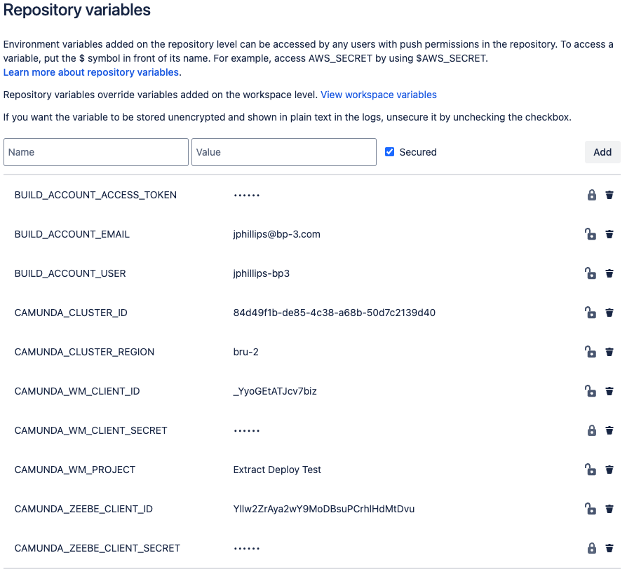
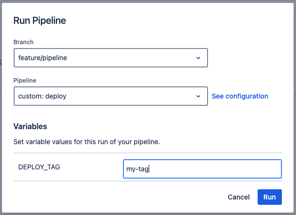

# Pipeline examples for Bitbucket
This page shows an example Bitbucket pipeline `bitbucket-pipelines.yml` file that can be used to execute stages for extraction and deployment for the following installation types:

1. SaaS: Web Modeler and Zeebe Cluster
2. Self-Managed: Web Modeler and Zeebe Cluster
3. docker-compose: Web Modeler and Zeebe Cluster

The example `bitbucket-pipelines.yml` file in this page is for SaaS, Self-Managed and Docker Compose, but follows the same structure,
with adjustments to the environment variables to suit as detailed in [README.md](./README.md#supported-environment-variables).

## Variables
It is best practice is to have many of the environment variables that are required, pre-defined.
Commonly these will be added as CI / CD variables defined at group level, so that they can be re-used across a
wide range of projects. In the example below the following variables are assumed to have
been defined at the group level and so are simply re-used as shown.



## Pre-requisites
The following items are needed to run the extraction:

* Web Modeler with a project:
    * Make a note of the name and UUID of the project, where the UUID can be extracted from the URL of the Web Modeller project, e.g. `aaaa-bbbb-cccc-dddd-eeee` from https://modeler.camunda.io/projects/aaaa-bbbb-cccc-dddd-eeee--my-project
* A Bitbucket repository:
    * Make a note of its full path, for example `/mygroup/myrepository`
    * Repository has a file called `config.json` in the root directory, that contains at least the Id of the WM project, e.g.:

```json
{
  "project": {
    "id": "aaaa-bbbb-cccc-dddd-eeee",
    "name": "My Project"
  }
}
```

## `bitbucket-pipelines.yml`
Below is an example on how the Docker image could be used when defining the pipeline configuration. It shows two pipelines defined, `extract` and `deploy`, that are executed when the custom pipeline is selected from the Pipeline Runner.

If the `deploy` pipeline is selected, then you will be promoted to enter the `DEPLOY_TAG` value which will cause the resources committed for the tag to be deployed to Zeebe, as shown in the example below:



```yaml
pipelines:
  custom:
    extract:
      - step:
          image: bp3global/wm-extract-deploy
          name: Extract Artifacts from Web Modeler
          services:
            - docker
          script:
            - |
              export CICD_PLATFORM="bitbucket"
              export CICD_SERVER_HOST="bitbucket.org"
              export CICD_ACCESS_TOKEN=$BUILD_ACCOUNT_ACCESS_TOKEN
              export CICD_REPOSITORY_PATH=$BITBUCKET_REPO_FULL_NAME
              export CICD_BRANCH=$BITBUCKET_BRANCH
              export CAMUNDA_WM_CLIENT_ID=$CAMUNDA_WM_CLIENT_ID
              export CAMUNDA_WM_CLIENT_SECRET=$CAMUNDA_WM_CLIENT_SECRET
              export CAMUNDA_WM_PROJECT=$CAMUNDA_WM_PROJECT
              export GIT_USERNAME=$BUILD_ACCOUNT_USER
              export GIT_USER_EMAIL=$BUILD_ACCOUNT_EMAIL
              export OAUTH2_TOKEN_URL=$OAUTH2_TOKEN_URL
              export SKIP_CI="true"
              /scripts/extractDeploy.sh extract
    deploy-saas:
      - variables:
          - name: DEPLOY_TAG
      - step:
          image: bp3global/wm-extract-deploy
          name: Deploy Web Modeler Artifacts to Zeebe
          services:
            - docker
          script:
            - |
              export ZEEBE_CLIENT_ID=$CAMUNDA_ZEEBE_CLIENT_ID
              export ZEEBE_CLIENT_SECRET=$CAMUNDA_ZEEBE_CLIENT_SECRET
              export CAMUNDA_CLUSTER_ID=$CAMUNDA_CLUSTER_ID
              export CAMUNDA_CLUSTER_REGION=$CAMUNDA_CLUSTER_REGION
              export PROJECT_TAG=$DEPLOY_TAG
              /scripts/extractDeploy.sh deploy
              
    deploy-sm-dc:
      - variables:
          - name: DEPLOY_TAG
      - step:
          image: bp3global/wm-extract-deploy
          name: Deploy Web Modeler Artifacts to Zeebe
          services:
            - docker
          script:
            - |
              export ZEEBE_CLIENT_ID=$CAMUNDA_ZEEBE_CLIENT_ID
              export ZEEBE_CLIENT_SECRET=$CAMUNDA_ZEEBE_CLIENT_SECRET
              export CAMUNDA_CLUSTER_HOST=$CAMUNDA_CLUSTER_HOST
              export CAMUNDA_CLUSTER_PORT=$CAMUNDA_CLUSTER_PORT
              export PROJECT_TAG=$DEPLOY_TAG
              export OAUTH2_TOKEN_URL=$OAUTH2_TOKEN_URL
              /scripts/extractDeploy.sh deploy
```

## Sharing Pipelines
Or even better define these pipelines for the entire workspace

* Create a repo called `camunda-pipelines`
  * Add file `bitbucket-pipelines.yml` as below
* Import these as required - see further below (see [Share pipelines configurations](https://support.atlassian.com/bitbucket-cloud/docs/share-pipelines-configurations/]))

```yaml
export: true

definitions:
  pipelines:
    extract:
      - step:
          image: bp3global/wm-extract-deploy
          name: Extract Artifacts from Web Modeler
          services:
            - docker
          script:
            - |
              export CICD_PLATFORM="bitbucket"
              export CICD_SERVER_HOST="bitbucket.org"
              export CICD_ACCESS_TOKEN=$BUILD_ACCOUNT_ACCESS_TOKEN
              export CICD_REPOSITORY_PATH=$BITBUCKET_REPO_FULL_NAME
              export CICD_BRANCH=$BITBUCKET_BRANCH
              export CAMUNDA_WM_CLIENT_ID=$CAMUNDA_WM_CLIENT_ID
              export CAMUNDA_WM_CLIENT_SECRET=$CAMUNDA_WM_CLIENT_SECRET
              export CAMUNDA_WM_PROJECT=$CAMUNDA_WM_PROJECT
              export CAMUNDA_CLUSTER_ID=$CAMUNDA_CLUSTER_ID
              export CAMUNDA_CLUSTER_REGION=$CAMUNDA_CLUSTER_REGION
              export GIT_USERNAME=$BUILD_ACCOUNT_USER
              export GIT_USER_EMAIL=$BUILD_ACCOUNT_EMAIL
              export SKIP_CI="true"
              export OAUTH2_TOKEN_URL=$OAUTH2_TOKEN_URL
              /scripts/extractDeploy.sh extract
    deploy-saas:
      - variables:
          - name: DEPLOY_TAG
      - step:
          image: bp3global/wm-extract-deploy
          name: Deploy Web Modeler Artifacts to Zeebe
          services:
            - docker
          script:
            - |
              export ZEEBE_CLIENT_ID=$CAMUNDA_ZEEBE_CLIENT_ID
              export ZEEBE_CLIENT_SECRET=$CAMUNDA_ZEEBE_CLIENT_SECRET
              export CLUSTER_ID=$CAMUNDA_CLUSTER_ID
              export CLUSTER_REGION=$CAMUNDA_CLUSTER_REGION
              export PROJECT_TAG=$DEPLOY_TAG
              /scripts/extractDeploy.sh deploy
              
    deploy-sm-dc:
      - variables:
          - name: DEPLOY_TAG
      - step:
          image: bp3global/wm-extract-deploy
          name: Deploy Web Modeler Artifacts to Zeebe
          services:
            - docker
          script:
            - |
              export ZEEBE_CLIENT_ID=$CAMUNDA_ZEEBE_CLIENT_ID
              export ZEEBE_CLIENT_SECRET=$CAMUNDA_ZEEBE_CLIENT_SECRET
              export CLUSTER_HOST=$CAMUNDA_CLUSTER_HOST
              export CLUSTER_PORT=$CAMUNDA_CLUSTER_PORT
              export PROJECT_TAG=$DEPLOY_TAG
              export OAUTH2_TOKEN_URL=$OAUTH2_TOKEN_URL
              /scripts/extractDeploy.sh deploy
```

The following `bitbucket-pipelines.yml` file then becomes part of the "template" that is applied
to every new Bitbucket repo that is created to track a Web Modeler project. In this way any changes
that need to be made to the pipeline(s) can be made in one place, and immediately rolled out
to all the projects.

```yaml
pipelines:
  custom:
    extract:
      import: camunda-pipelines:master:extract

    deploy-saas:
      import: camunda-pipelines:master:deploy-saas

```
