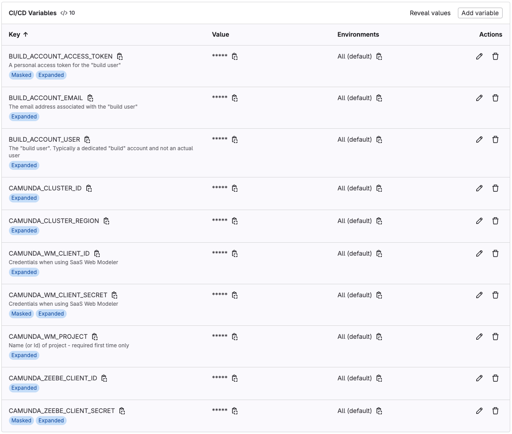

# Pipeline examples for GitLab
This page shows an example GitLab pipeline `gitlab-ci.yml` file that can be used to execute stages for extraction and deployment for the following installation types:

1. SaaS: Web Modeler and Zeebe Cluster
2. Self-Managed: Web Modeler and Zeebe Cluster
3. docker-compose: Web Modeler and Zeebe Cluster

The example `gitlab-ci.yml` file in this page is for SaaS, Self-Managed and Docker Compose, but follows the same structure, 
with adjustments to the environment variables to suit as detailed in [README.md](./README.md#supported-environment-variables).

## Variables
It is best practice to have many of the environment variables that are required, pre-defined.
Commonly these will be added as CI / CD variables defined at group level, so that they can be re-used across a
wide range of projects. In the example below the following variables are assumed to have
been defined at the group level and so are simply re-used as shown.



## Pre-requisites
The following items are needed to run the extraction:

* Web Modeler with a project:
  * Make a note of the name and UUID of the project, where the UUID can be extracted from the URL of the Web Modeller project, e.g. `aaaa-bbbb-cccc-dddd-eeee` from https://modeler.camunda.io/projects/aaaa-bbbb-cccc-dddd-eeee--my-project
* A GitLab repository:
  * Make a note of its full path, for example `/mygroup/myrepository`
  * Repository has a file called `config.json` in the root directory, that contains at least the Id of the WM project, e.g.:

```json
{
  "project": {
    "id": "aaaa-bbbb-cccc-dddd-eeee",
    "name": "My Project"
  }
}
```

## `gitlab-ci.yml`
Below is an example on how the Docker image could be used when defining the pipeline configuration. It shows two stages, 'extract' and 'deploy', that are executed based on the state of the `MODE` and `DEPLOY_TAG` environment variables.

```yaml
image: bp3global/wm-extract-deploy

variables:
  CICD_PLATFORM: gitlab
  CICD_SERVER_HOST: $CI_SERVER_HOST
  CICD_ACCESS_TOKEN: $BUILD_ACCOUNT_ACCESS_TOKEN
  CICD_REPOSITORY_PATH: $CI_PROJECT_PATH
  OAUTH2_TOKEN_URL: $OAUTH2_TOKEN_URL

stages:
  - extract
  - deploy

extract-artifacts-from-modeler:
  stage: extract
  rules:
    - if: $MODE == "extract"
      when: always
  variables:
    CAMUNDA_WM_PROJECT: $CAMUNDA_WM_PROJECT
    GIT_USERNAME: $BUILD_ACCOUNT_USER
    GIT_USER_EMAIL: $BUILD_ACCOUNT_EMAIL
    OAUTH2_CLIENT_ID: $CAMUNDA_WM_CLIENT_ID
    OAUTH2_CLIENT_SECRET: $CAMUNDA_WM_CLIENT_SECRET
    OAUTH2_TOKEN_URL: $OAUTH2_TOKEN_URL
    SKIP_CI: true
  script:
    /scripts/extractDeploy.sh extract

# Example of deploying to a SaaS cluster
deploy-modeler-artifacts-to-saas-zeebe:
  stage: deploy
  rules:
    - if: $MODE == "deploy" && $DEPLOY_TAG != null && $DEPLOY_TAG != ""
      when: always
  variables:
    OAUTH2_CLIENT_ID: $CAMUNDA_ZEEBE_CLIENT_ID
    OAUTH2_CLIENT_SECRET: $CAMUNDA_ZEEBE_CLIENT_SECRET
    PROJECT_TAG: $DEPLOY_TAG
    ZEEBE_CLUSTER_ID: $CAMUNDA_ZEEBE_CLUSTER_ID
    ZEEBE_CLUSTER_REGION: $CAMUNDA_CLUSTER_REGION
  script:
    /scripts/extractDeploy.sh deploy

# Example of deploying to a Self-Managed or Docker Compose cluster
deploy-modeler-artifacts-to-sm-dc-zeebe:
  stage: deploy
  rules:
    - if: $MODE == "deploy" && $DEPLOY_TAG != null && $DEPLOY_TAG != ""
      when: always
  variables:
    OAUTH2_CLIENT_ID: $CAMUNDA_ZEEBE_CLIENT_ID
    OAUTH2_CLIENT_SECRET: $CAMUNDA_ZEEBE_CLIENT_SECRET
    OAUTH2_TOKEN_URL: $OAUTH2_TOKEN_URL
    PROJECT_TAG: $DEPLOY_TAG
    ZEEBE_CLUSTER_HOST: $CAMUNDA_CLUSTER_HOST # This differs from SaaS
    ZEEBE_CLUSTER_PORT: $CAMUNDA_CLUSTER_PORT # This differs from SaaS
  script:
    /scripts/extractDeploy.sh deploy
```
