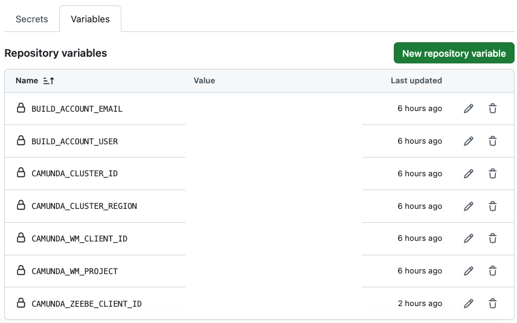
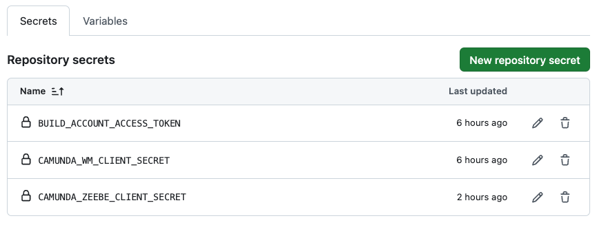
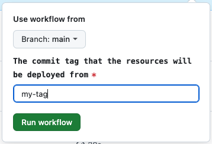

# Pipeline examples for Github
This page shows an example of Github pipelines files (`extract-pipelines.yml` and `deploy-pipelines.yml`) that can be used to execute stages for extraction and deployment for the following installation types:

1. SaaS: Web Modeler and Zeebe Cluster
2. Self-Managed: Web Modeler and Zeebe Cluster
3. docker-compose: Web Modeler and Zeebe Cluster

The example files in this page are for SaaS, Self-Managed and Docker Compose, but follows the same structure,
with adjustments to the environment variables to suit as detailed in [README.md](./README.md#supported-environment-variables).

## Variables
It is best practice to have many of the environment variables that are required, pre-defined.
Commonly these will be added as CI / CD variables defined at group level, so that they can be re-used across a
wide range of projects. In the example below the following variables and secrets are assumed to have
been defined at the group level and so are simply re-used as shown.





## Pre-requisites
The following items are needed to run the extraction:

* Web Modeler with a project:
    * Make a note of the name and UUID of the project, where the UUID can be extracted from the URL of the Web Modeller project, e.g. `aaaa-bbbb-cccc-dddd-eeee` from https://modeler.camunda.io/projects/aaaa-bbbb-cccc-dddd-eeee--my-project
* A Github repository:
    * Make a note of its full path, for example `/mygroup/myrepository`
    * Repository has a file called `config.json` in the root directory, that contains at least the Id of the WM project, e.g.:

```json
{
  "project": {
    "id": "aaaa-bbbb-cccc-dddd-eeee",
    "name": "My Project"
  }
}
```

## `extract-pipelines.yml` and `deploy-pipelines.yml`
Below is an example on how the Docker image could be used when defining the pipeline configuration. It shows two pipelines files defined, each with `extract` and `deploy` jobs, that are executed when the custom pipeline is selected from the Pipeline Runner. The reason for splitting into two files is due to the `on:workflow_dispatch` requiring only user pipeline inputs for the `deploy` job.

If the `deploy` pipeline is selected, then you will be prompted to enter the `DEPLOY_TAG` value which will cause the resources committed for the tag to be deployed to Zeebe, as shown in the example below:



### `extract-pipelines.yml`
```yaml
name: Extract Pipeline

on:
  workflow_dispatch:

jobs:
  extract:
    runs-on: ubuntu-latest
    container:
      image: bp3global/wm-extract-deploy
      options: --user 1001
    steps:
      - name: Checkout repository
        uses: actions/checkout@v4

      - name: Extract resource files
        env:
          CAMUNDA_WM_PROJECT: ${{ vars.CAMUNDA_WM_PROJECT }}
          CICD_PLATFORM: "github"
          CICD_ACCESS_TOKEN: ${{ secrets.BUILD_ACCOUNT_ACCESS_TOKEN }}
          CICD_REPOSITORY_PATH: ${{ github.repository }}
          CICD_BRANCH: ${{ github.ref_name }}
          GIT_USERNAME: ${{ vars.BUILD_ACCOUNT_USER }}
          GIT_USER_EMAIL: ${{ vars.BUILD_ACCOUNT_EMAIL }}
          OAUTH2_CLIENT_ID: ${{ vars.CAMUNDA_WM_CLIENT_ID }}
          OAUTH2_CLIENT_SECRET: ${{ secrets.CAMUNDA_WM_CLIENT_SECRET }}
          OAUTH2_TOKEN_URL: ${{ vars.OAUTH2_TOKEN_URL }}
          SKIP_CI: "true"
        run:
          /scripts/extractDeploy.sh extract

```

### `deploy-pipelines.yml`
```yaml
name: Deploy Pipeline

on:
  workflow_dispatch:
    inputs:
      deploy_tag:
        description: The commit tag that the resources will be deployed from
        required: true
        type: string

jobs:
  deploy:
    runs-on: ubuntu-latest
    container:
      image: bp3global/wm-extract-deploy
      options: --user 1001
    steps:
      - name: Checkout repository
        uses: actions/checkout@v4

      - name: Extract resource files
        env:
          PROJECT_TAG: ${{ inputs.deploy_tag }}
          OAUTH2_CLIENT_ID: ${{ vars.CAMUNDA_ZEEBE_CLIENT_ID }}
          OAUTH2_CLIENT_SECRET: ${{ secrets.CAMUNDA_ZEEBE_CLIENT_SECRET }}
          OAUTH2_TOKEN_URL: ${{ vars.OAUTH2_TOKEN_URL }}
          ZEEBE_CLUSTER_ID: ${{ vars.CAMUNDA_CLUSTER_ID }}
          ZEEBE_CLUSTER_REGION: ${{ vars.CAMUNDA_CLUSTER_REGION }}
        run:
          /scripts/extractDeploy.sh deploy
```
